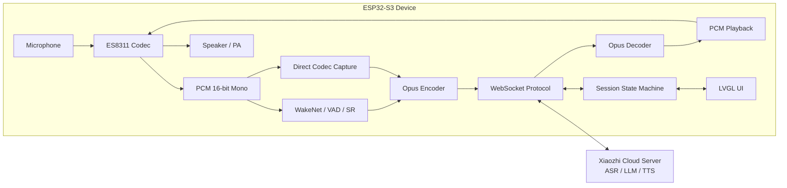

# ESP32 XIAOZHI AI Voice Assistant

基于 **ESP32-S3 + ESP-IDF** 的小智 AI 语音助手端侧工程。项目目标不是简单调用云端大模型 API，而是在嵌入式设备端打通从配网、设备激活、WebSocket 会话、Opus 音频上下行、ES8311 播放，到状态机恢复与 UI 提示的一整套 AIoT 语音交互链路。

> 当前 README 按仓库现阶段代码和验证记录重写。项目仍处于分阶段收口中，下面的“当前状态”比功能列表更重要。

## 1. 项目定位

这个仓库更适合被理解为一个 **端云协同语音前端**：

- 端侧负责设备联网、身份生成、OTA/激活请求、WebSocket 长连接和音频 I/O。
- 端侧通过 ES8311/I2S 处理麦克风采集和扬声器播放。
- 端侧通过 Opus 对音频进行压缩/解码，降低网络传输压力。
- 云端负责 ASR、LLM、TTS 等智能能力，设备侧负责协议、状态机和硬件执行。
- UI 侧通过 LVGL 展示配网、激活、连接和错误状态。

一句话概括：**这是一个围绕实时语音链路、网络协议、RTOS 任务和硬件资源约束展开的 ESP32-S3 AIoT 项目。**

## 2. 当前状态

| 模块 / 阶段 | 状态 | 说明 |
| --- | --- | --- |
| Wi-Fi / 配网 | 阶段可用 | 已具备 STA 连接、配网状态展示和 provisioning 生命周期处理，仍需继续回归异常断开、重复配网等边界。 |
| OTA / 激活 | 阶段可用 | 能请求小智 OTA/激活接口，解析激活状态、WebSocket URL 和 token。 |
| WebSocket | 阶段可用 | 已实现连接、hello 握手、server hello 解析、session_id 保存和 READY 状态。 |
| P0 文本触发语音下行 | 已实机验证 | SW3 单击发送测试文本，云端返回 STT/TTS JSON 和二进制 Opus，设备完成 24 kHz Opus 解码和 ES8311/I2S/PA 播放。 |
| P1 手动上行语音 | 已完成基础收口 | SW3 长按录音、松开发送 stop，可识别语音并收到回复；播放期间不做打断，符合当前 P1 设计边界。 |
| P2 稳定性恢复 | 持续收口 | 已加入 WAITING_RESPONSE 超时恢复、TTS speaking watchdog、统计和水位日志，仍需更多轮真机稳定性数据。 |
| P3 WakeNet/VAD 自动对话 | 代码与静态护栏已接入 | 已有 SR pause/resume、VAD 触发自动 listen、SR PCM 外部喂给 Opus 等路径；仍建议作为后续重点验证项，不能直接等同于量产级自动语音助手。 |
| MCP / IoT / Camera / 更复杂 UI | 未作为当前主线 | 当前主线优先保证基础语音链路、状态机和资源稳定性。 |

## 3. 系统架构



核心数据流：

```text
上行：Mic -> ES8311/I2S -> PCM -> SR 或 Direct Capture -> Opus Encode -> WebSocket Binary -> Xiaozhi Server
下行：Xiaozhi Server -> WebSocket Binary -> Opus Decode -> PCM -> ES8311/I2S/PA -> Speaker
控制：JSON <-> WebSocket <-> Session State Machine / UI / Device Control
```

## 4. 技术栈

| 分类 | 组件 / 技术 |
| --- | --- |
| MCU / SDK | ESP32-S3, ESP-IDF >= 5.3 |
| RTOS | FreeRTOS task, queue, timer, ringbuffer, event group |
| 网络 | Wi-Fi STA, provisioning, HTTP client, WebSocket client, TLS certificate bundle |
| 音频硬件 | ES8311 codec, I2S, PA, microphone, speaker |
| 音频软件 | esp_codec_dev, esp_audio_codec, Opus encode/decode |
| 语音前端 | esp-sr, WakeNet, VAD, SR feed/detect task |
| UI | LVGL 9, esp_lvgl_port, LCD BSP, status screen |
| 数据格式 | JSON / cJSON, WebSocket text frame, WebSocket binary frame |
| 质量护栏 | Python static guardrails, build verification, heap/stack watermark logs |

## 5. 目录结构

```text
.
├── CMakeLists.txt
├── README.md
├── partitions.csv
├── sdkconfig.defaults
├── docs/
│   ├── xiaozhi_stage1_repo_map.md
│   ├── xiaozhi_stage1_review.md
│   ├── xiaozhi_voice_loop_progress_report.md
│   └── xiaozhi_p1_quality_work_summary.md
├── tools/
│   ├── check_stage1_lifecycle.py
│   ├── check_p0_voice_loop.py
│   ├── check_p1_manual_uplink_voice.py
│   └── check_p3_wakenet_vad.py
├── main/
│   ├── app/                         # app_main、业务控制器、按键事件分发、xiaozhi stage1 启动
│   ├── platform/                    # NVS、netif、event loop 等平台初始化
│   ├── bsp/
│   │   ├── audio/                   # ES8311 / I2S / PA 板级音频接口
│   │   ├── button/                  # 板级按键
│   │   ├── lcd/                     # LCD panel bring-up
│   │   └── led/                     # 状态灯
│   ├── services/
│   │   ├── network/                 # Wi-Fi STA 服务
│   │   ├── provisioning/            # 配网流程与 QR payload
│   │   ├── audio/                   # PCM、Opus codec、Opus stream、音频诊断
│   │   └── sr/                      # WakeNet / VAD / SR 服务
│   ├── ui/
│   │   ├── display/                 # LVGL display service 与小智 UI
│   │   ├── screens/                 # provisioning screen
│   │   └── led/                     # LED 状态服务
│   └── xiaozhi/                     # device identity、OTA、protocol、WebSocket 状态机
└── test_apps/
    └── xiaozhi_protocol_test/       # 小智协议解析/构造测试
```

## 6. 核心模块说明

### 6.1 设备身份与 OTA 激活

启动后，设备会读取或生成 UUID，获取 MAC、IP、SSID、RSSI 等信息，并向小智 OTA/激活接口发送设备信息。响应中包含激活状态、激活码、WebSocket URL、WebSocket token 等运行时参数。

关键文件：

- `main/xiaozhi/xiaozhi_device.c`
- `main/xiaozhi/xiaozhi_handle.c`
- `main/xiaozhi/xiaozhi_ota.c`
- `main/app/xiaozhi_stage1.c`

### 6.2 WebSocket 会话状态机

WebSocket 层负责：

- 设置 `Authorization`、`Protocol-Version`、`Device-Id`、`Client-Id` 等 header。
- 建立 WebSocket 连接。
- 发送 hello JSON。
- 解析 server hello 和 `session_id`。
- 管理 `DISCONNECTED -> CONNECTING -> WS_CONNECTED -> HELLO_SENT -> READY -> LISTENING -> WAITING_RESPONSE -> SPEAKING -> READY` 等状态。
- 接收 JSON 控制消息和二进制 Opus 音频帧。
- 处理 READY 空闲断开后的再次触发恢复。

关键文件：

- `main/xiaozhi/xiaozhi_ws.c`
- `main/xiaozhi/xiaozhi_protocol.c`
- `main/app/app_controller.c`

### 6.3 Opus 音频流

音频流被拆成独立任务和缓冲区，避免采集、编码、网络发送、解码、播放互相阻塞。

- 上行：16 kHz / mono / 16-bit / 60 ms PCM 帧，编码为 Opus 后通过 WebSocket binary 发送。
- 下行：服务器返回 Opus binary，按 server hello 中的输出采样率解码为 PCM，再写入 ES8311/I2S 播放。
- P1 手动语音路径使用直接 codec capture，长按开始录音，松开发送 listen stop。
- P3 自动语音路径使用 SR/VAD 输出 PCM，再外部喂给 Opus uplink。

关键文件：

- `main/services/audio/audio_opus_codec.c`
- `main/services/audio/audio_opus_stream.c`
- `main/services/audio/audio_pcm_service.c`
- `main/bsp/audio/bsp_audio.c`

### 6.4 SR / WakeNet / VAD

SR 服务用于唤醒和语音活动检测。由于 ES8311/I2S 是共享音频资源，SR 与下行播放之间必须明确所有权：播放 TTS 前需要暂停或释放 SR 读取路径，播放结束后再恢复。

关键文件：

- `main/services/sr/xiaozhi_sr.c`
- `main/app/xiaozhi_stage1.c`
- `tools/check_p3_wakenet_vad.py`

### 6.5 LVGL UI

UI 用于显示配网二维码、激活提示、连接状态、错误状态等。LVGL 修改路径通过 `lvgl_port_lock()` / `lvgl_port_unlock()` 保护，避免从网络或任务上下文直接破坏 LVGL 线程边界。

关键文件：

- `main/ui/display/display_service.c`
- `main/ui/display/xiaozhi_ui.c`
- `main/ui/screens/provisioning_screen.c`

## 7. 构建与烧录

### 7.1 环境要求

- ESP-IDF 5.3 或更新版本。
- 目标芯片：ESP32-S3。
- 已正确配置串口、Python 环境和 ESP-IDF export 环境。
- 板端具备 ES8311 codec、麦克风、扬声器/功放、LCD、按键等外设。

### 7.2 构建

Windows PowerShell 示例：

```powershell
$env:IDF_PYTHON_ENV_PATH='E:/Espressif/python_env/idf5.3_py3.11_env'
. 'E:/Espressif/frameworks/esp-idf-v5.3.1/export.ps1'
idf.py set-target esp32s3
idf.py build
```

### 7.3 烧录与串口监视

```powershell
idf.py -p COM16 flash monitor
```

如果你的开发板串口不是 `COM16`，把命令里的端口改成实际端口。

## 8. 常用验证命令

```powershell
idf.py build
python tools/check_stage1_lifecycle.py
python tools/check_p0_voice_loop.py
python tools/check_p1_manual_uplink_voice.py
python tools/check_p3_wakenet_vad.py
```

建议每次改动 WebSocket、音频、SR、provisioning 生命周期或按键事件时，至少跑一次对应静态护栏。真机验证仍然不可替代，尤其是音频链路、Wi-Fi 断开恢复、堆内存水位和多轮对话稳定性。

## 9. 板端交互说明

当前主线交互以按键触发为主：

- 首次启动：进入配网/激活流程，LCD 显示 QR 或状态提示。
- SW3 单击：触发 P0 文本 detect 测试，用于验证 WebSocket、TTS 下行和播放链路。
- SW3 长按：触发 P1 手动录音上行。
- SW3 松开：停止录音并等待云端 STT/TTS 回复。
- TTS 播放期间：当前 P1 设计不支持打断播放，按键请求会被忽略或延后处理。

## 10. 已知边界

这些边界必须明确，不能在简历或面试中夸大：

1. 云端 ASR / LLM / TTS 能力不是本仓库实现的，本仓库重点是端侧链路、协议和硬件控制。
2. P0/P1 已能证明基础对话链路，但距离量产级语音助手还需要更多稳定性测试。
3. WakeNet/VAD 自动对话路径已有代码和静态检查，但仍需要持续做真机回归。
4. 播放打断、全双工、AEC、复杂 IoT/MCP、Camera、多媒体 UI 不是当前主线能力。
5. 内部 SRAM、PSRAM、任务栈、水位日志仍然是后续优化重点，尤其在 Wi-Fi/TLS/WebSocket/LVGL/SR/Opus 同时运行时。

## 11. 面试表达建议

可以这样介绍这个项目：

> 这个项目是一个基于 ESP32-S3 的端云协同 AI 语音助手前端。我重点做的不是大模型本身，而是端侧实时语音链路：设备先完成配网和激活，再通过 WebSocket 建立会话；上行把 ES8311/I2S 采集到的 PCM 编码为 Opus 发送给云端，下行接收云端返回的 Opus 并解码播放。项目中比较核心的是 WebSocket 状态机、Opus 音频流任务、ES8311 音频资源所有权、LVGL 状态显示，以及在内存受限条件下做异常恢复和多轮对话稳定性收口。

面试中建议主动讲清楚三个点：

- **端侧边界**：端侧负责音频、协议、状态机、硬件，不负责云端 ASR/LLM/TTS。
- **实时性难点**：采集、编码、网络、解码、播放速率不同，必须用任务和缓冲区解耦。
- **工程边界**：P0/P1 已验证，P3 自动语音与量产稳定性仍是后续重点，不能吹成完全成熟产品。

## 12. 后续计划

- 继续刷机复测 Wi-Fi country/channel warning。
- 增加多轮语音质量数据：正常说话、近讲、静音三组 RMS/peak/clip 对比。
- 持续观察 internal heap、PSRAM、task stack watermark。
- 收口 WakeNet/VAD 自动对话路径的真机稳定性。
- 评估是否引入播放打断、AEC、全双工或更复杂 IoT/MCP 能力。
