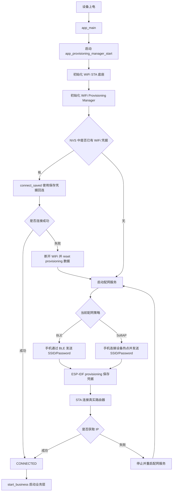
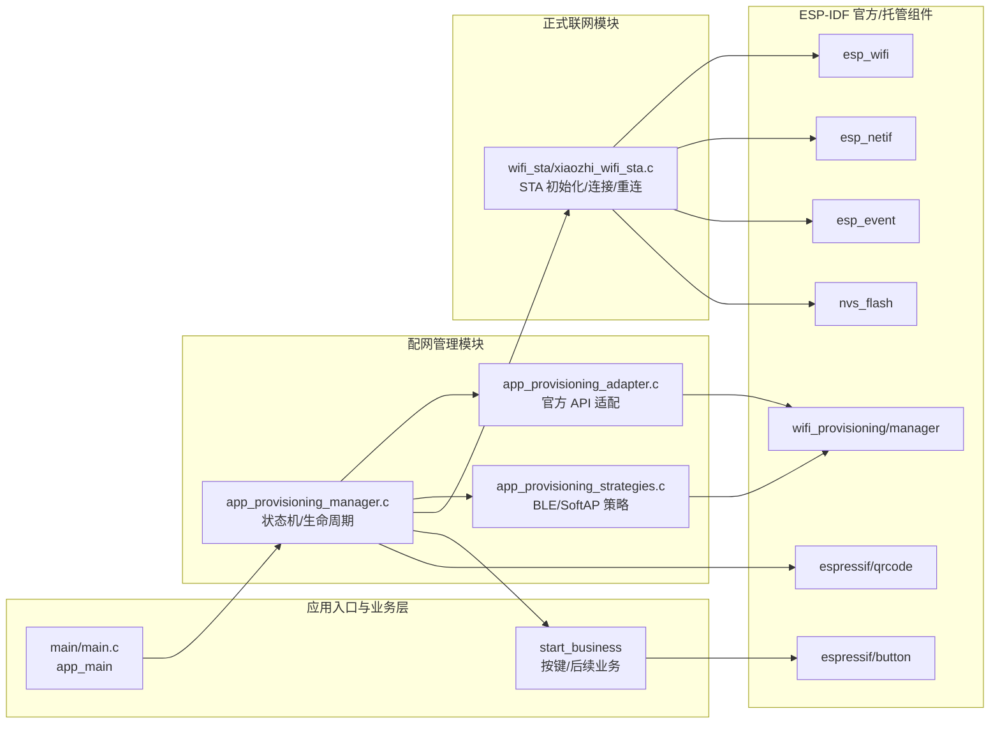
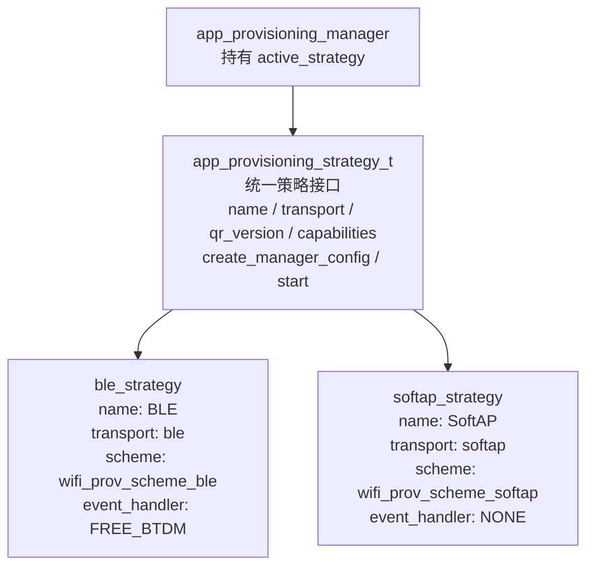
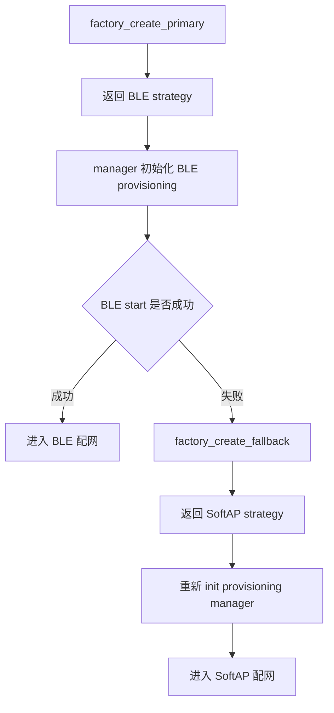
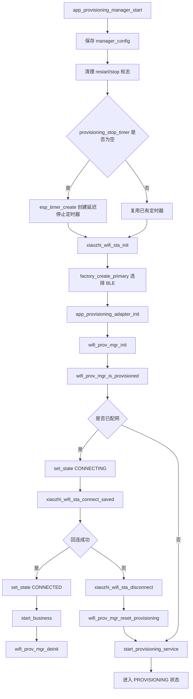
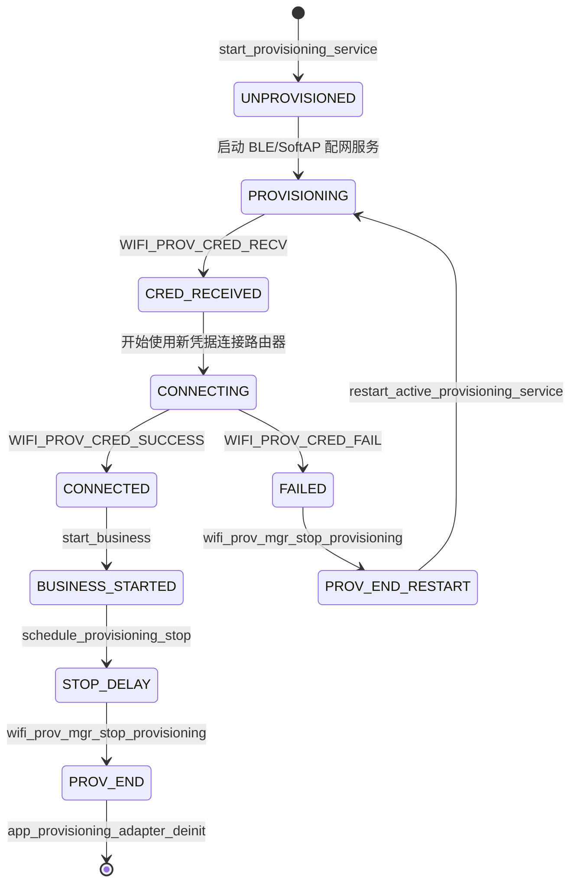
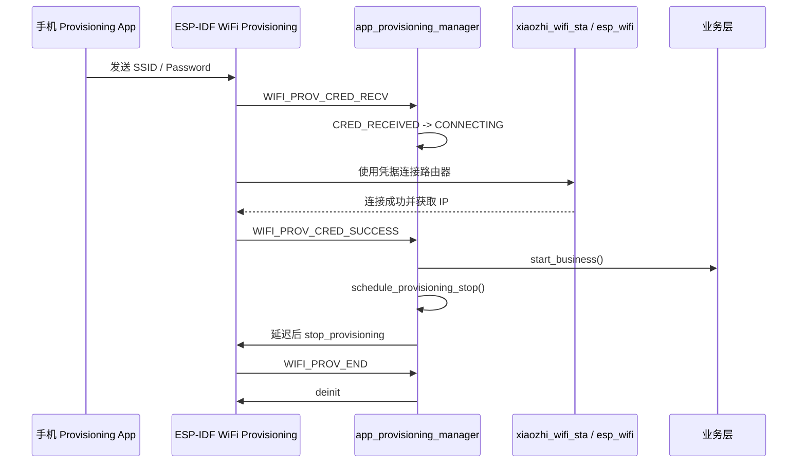
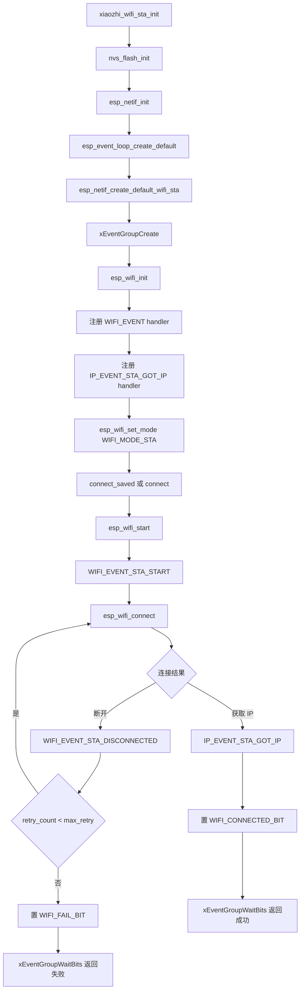
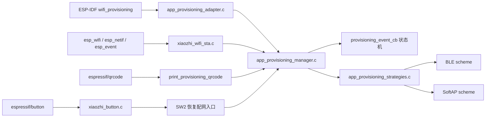
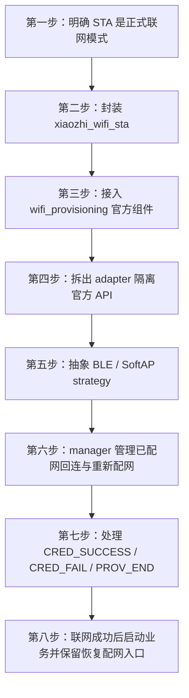

# ESP32-S3 WiFi 与配网开发流程学习笔记

## 1. 学习主线

本阶段学习重点不是单独记忆 BLE、SoftAP 或 WiFi API，而是熟悉一个 ESP-IDF 联网设备从上电到业务启动的完整开发流程。

```text
设备上电
  -> 初始化基础环境
  -> 初始化 WiFi STA 底座
  -> 初始化 provisioning manager
  -> 判断 NVS 中是否已有 WiFi 凭据
  -> 已有凭据：尝试直接 STA 回连路由器
  -> 无凭据或回连失败：启动配网服务
  -> 通过 BLE 或 SoftAP 接收 SSID / Password
  -> ESP-IDF provisioning 组件保存凭据
  -> STA 模式连接真实路由器
  -> 获取 IP 后触发联网成功
  -> 停止配网服务并启动业务层
```

核心结论：BLE 配网和 SoftAP 配网不是设备最终的联网方式，它们只是把 WiFi 凭据送进设备的两种通道。设备长期运行时依然依赖 STA 模式连接路由器。

### 1.1 项目总流程图



本工程已经将这条链路拆成几个明确模块：

```text
main/main.c
  -> 系统入口和业务回调注册

main/app_provisioning/app_provisioning_manager.c
  -> 配网状态机、是否已配网判断、失败恢复、业务启动时机

main/app_provisioning/app_provisioning_strategies.c
  -> BLE / SoftAP 两种配网策略

main/app_provisioning/app_provisioning_adapter.c
  -> 对 ESP-IDF wifi_provisioning manager 的薄封装

main/wifi_sta/xiaozhi_wifi_sta.c
  -> WiFi STA 初始化、连接、重连、事件处理

main/Kconfig.projbuild
  -> WiFi 与配网参数的 menuconfig 配置入口

main/idf_component.yml / main/CMakeLists.txt
  -> 本次 WiFi provisioning、qrcode、button 相关组件接入点
```

---

## 2. 工程中的联网分层

当前代码的分层比较清晰，适合按照“入口层 -> 配网管理层 -> 策略层 -> STA 联网层 -> 业务层”来理解。

### 2.0 模块架构图



### 2.1 入口层：`main.c`

`app_main()` 没有直接操作 BLE、SoftAP 或 WiFi 细节，而是构造 `app_provisioning_manager_config_t`，把两个回调交给配网管理器：

```c
const app_provisioning_manager_config_t provisioning_config = {
    .business_start_cb = start_business,
    .state_cb = provisioning_state_cb,
    .user_ctx = NULL,
};

esp_err_t err = app_provisioning_manager_start(&provisioning_config);
```

这里体现了一个重要流程：入口函数只做系统编排，不堆叠底层联网细节。联网成功后的业务启动由 `business_start_cb` 回调承接。

当前业务启动函数 `start_business()` 中初始化按键模块，并注册 SW2、SW3 的按键事件。SW2 单击时调用 `app_provisioning_manager_reset_and_restart()`，用于清除保存的 WiFi / provisioning 数据并重启设备，相当于一个恢复配网入口。

### 2.2 配网管理层：`app_provisioning_manager.c`

该文件是本次学习的重点。它负责管理完整配网状态机：

```text
选择配网策略
  -> 初始化 provisioning manager
  -> 查询是否已配网
  -> 已配网则尝试保存凭据回连
  -> 回连失败则清理旧凭据
  -> 未配网或凭据失效则启动配网服务
  -> 接收 provisioning 事件
  -> 配网成功后启动业务
  -> 延迟停止 provisioning 服务
  -> 配网失败后重启服务或切 fallback 策略
```

关键全局状态：

```c
static app_provisioning_state_t current_state;
static app_provisioning_manager_config_t manager_config;
static const app_provisioning_strategy_t *active_strategy;
static bool restart_provisioning_after_stop;
static bool stop_requested_by_app;
static esp_timer_handle_t provisioning_stop_timer;
```

这些变量分别承担：当前状态、上层回调配置、当前配网策略、失败后是否重启配网、是否由应用主动停止配网、延迟停止配网服务的定时器。

### 2.3 策略层：`app_provisioning_strategies.c`

策略层封装 BLE 和 SoftAP 的差异。上层 manager 不直接关心当前是 BLE 还是 SoftAP，只通过统一接口启动策略。

当前定义了两个策略对象：

```c
static const app_provisioning_strategy_t ble_strategy = {
    .name = "BLE",
    .transport = "ble",
    .qr_version = "v1",
    .capabilities = "wifi_scan",
    .create_manager_config = create_ble_manager_config,
    .start = strategy_start,
};

static const app_provisioning_strategy_t softap_strategy = {
    .name = "SoftAP",
    .transport = "softap",
    .qr_version = "v1",
    .capabilities = "wifi_scan",
    .create_manager_config = create_softap_manager_config,
    .start = strategy_start,
};
```

两种策略的共同目标都是启动 ESP-IDF provisioning 服务，差异集中在 `wifi_prov_mgr_config_t` 的 `.scheme`：

```c
.scheme = wifi_prov_scheme_ble
.scheme = wifi_prov_scheme_softap
```

### 2.4 适配层：`app_provisioning_adapter.c`

适配层是对 ESP-IDF 官方 `wifi_provisioning/manager.h` 的薄封装，主要用于隔离官方 API：

```c
wifi_prov_mgr_init(manager_config);
wifi_prov_mgr_is_provisioned(provisioned);
strategy->start(strategy, service_name, service_key);
wifi_prov_mgr_deinit();
```

该层目前逻辑很轻，但工程意义明确：manager 面向自定义 adapter，adapter 面向 ESP-IDF 官方组件。后续如果需要替换 provisioning 方案、补日志、补错误转换、增加统计埋点，不需要大幅改 manager。

### 2.5 STA 联网层：`xiaozhi_wifi_sta.c`

该模块只负责正式联网，不关心 BLE / SoftAP，也不关心业务是小智、门铃还是其他应用。

职责范围：

```text
初始化 NVS
初始化 esp_netif
创建默认事件循环
创建 STA netif
初始化 WiFi driver
注册 WiFi / IP 事件
设置 WIFI_MODE_STA
连接保存的 WiFi 或指定 WiFi
处理断线重连
收到 IP 后通知连接成功
```

这个模块是正式联网链路的基础。BLE 和 SoftAP 只是把凭据送到系统中，最终是否联网成功，仍然要落到 `WIFI_EVENT_STA_START`、`WIFI_EVENT_STA_DISCONNECTED`、`IP_EVENT_STA_GOT_IP` 这些事件上。

---

## 3. 两种配网模式在工程中的实现

### 3.1 BLE 配网

BLE 配网通过 Bluetooth LE GATT 通道把 WiFi 凭据传给 ESP32-S3。手机端通常使用 Espressif Provisioning App 扫描设备、建立安全会话、提交路由器 SSID 和密码。

本工程中 BLE 策略的关键配置：

```c
static wifi_prov_mgr_config_t create_ble_manager_config(wifi_prov_cb_func_t event_cb, void *user_data)
{
    wifi_prov_mgr_config_t config = {
        .scheme = wifi_prov_scheme_ble,
        .scheme_event_handler = WIFI_PROV_SCHEME_BLE_EVENT_HANDLER_FREE_BTDM,
        .app_event_handler = {
            .event_cb = event_cb,
            .user_data = user_data,
        },
    };

    return config;
}
```

重点 API：

- `wifi_prov_scheme_ble`：指定 provisioning 走 BLE 传输。
- `WIFI_PROV_SCHEME_BLE_EVENT_HANDLER_FREE_BTDM`：BLE 配网结束后释放 BTDM 资源，降低后续业务运行时内存压力。
- `app_event_handler.event_cb`：将官方 provisioning 事件回调接入本工程的 `provisioning_event_cb()`。

BLE 适合作为默认首配方式，用户不需要切换手机 WiFi，体验更接近量产智能硬件。但 BLE 依赖蓝牙权限、手机兼容性、蓝牙栈内存，调试复杂度高于 SoftAP。

### 3.2 SoftAP 配网

SoftAP 配网中，ESP32-S3 临时创建热点，手机连接该热点后通过 provisioning 协议提交路由器凭据。

本工程中 SoftAP 策略的关键配置：

```c
static wifi_prov_mgr_config_t create_softap_manager_config(wifi_prov_cb_func_t event_cb, void *user_data)
{
    wifi_prov_mgr_config_t config = {
        .scheme = wifi_prov_scheme_softap,
        .scheme_event_handler = WIFI_PROV_EVENT_HANDLER_NONE,
        .app_event_handler = {
            .event_cb = event_cb,
            .user_data = user_data,
        },
    };

    return config;
}
```

重点 API：

- `wifi_prov_scheme_softap`：指定 provisioning 走 SoftAP 传输。
- `WIFI_PROV_EVENT_HANDLER_NONE`：SoftAP 策略不需要 BLE 那样的蓝牙资源释放处理。
- `CONFIG_APP_PROV_SERVICE_NAME`：SoftAP 下表现为设备热点 SSID。
- `CONFIG_APP_PROV_SERVICE_KEY`：SoftAP 下表现为设备热点密码。

SoftAP 的优点是调试直观、协议链路容易理解、不依赖蓝牙权限。缺点是手机需要切换到设备热点，且部分手机会因为热点无外网而自动断开或切回原 WiFi。

### 3.3 当前策略选择与 fallback

BLE 和 SoftAP 当前被建模成两个可替换策略，manager 持有 `active_strategy`，启动失败时从 BLE fallback 到 SoftAP。





当前代码中：

```c
const app_provisioning_strategy_t *app_provisioning_strategy_factory_create_primary(void)
{
    return &ble_strategy;
}

const app_provisioning_strategy_t *app_provisioning_strategy_factory_create_fallback(const app_provisioning_strategy_t *current)
{
    if (current == &ble_strategy) {
        return &softap_strategy;
    }

    return NULL;
}
```

实际行为是：BLE 固定为主策略，SoftAP 固定为 fallback。`Kconfig.projbuild` 中虽然定义了 `APP_PROV_TRANSPORT_BLE` / `APP_PROV_TRANSPORT_SOFTAP` 选择项，但当前 factory 尚未根据这些宏动态选择 primary。后续如果要让 menuconfig 真正控制主策略，需要在 factory 中接入 `#if CONFIG_APP_PROV_TRANSPORT_BLE` 和 `#elif CONFIG_APP_PROV_TRANSPORT_SOFTAP`。

当前 fallback 场景主要有两类：

```text
首选策略启动失败
  -> switch_to_fallback_strategy("preferred provisioning start failed")

当前策略重启失败
  -> switch_to_fallback_strategy("restart preferred provisioning failed")
```

这种设计使 BLE 出现初始化失败时仍可退回 SoftAP，属于更贴近产品化的可靠性处理。

---

## 4. 配网 manager 的启动流程解析

`app_provisioning_manager_start()` 是配网总入口，建议作为本阶段重点精读函数。

### 4.0 manager 启动流程图



### 4.1 保存上层回调配置

```c
if (config != NULL) {
    manager_config = *config;
}
```

manager 不直接写死业务启动逻辑，而是保存上层传入的 `business_start_cb` 和 `state_cb`。这样配网模块只负责联网流程，业务启动由上层决定。

### 4.2 创建延迟停止配网的定时器

```c
if (provisioning_stop_timer == NULL) {
    const esp_timer_create_args_t timer_args = {
        .callback = stop_provisioning_timer_cb,
        .arg = NULL,
        .dispatch_method = ESP_TIMER_TASK,
        .name = "prov_stop_tm",
        .skip_unhandled_events = true,
    };
    ESP_RETURN_ON_ERROR(esp_timer_create(&timer_args, &provisioning_stop_timer), TAG, "create provisioning stop timer failed");
}
```

该定时器用于“配网成功后延迟停止 provisioning 服务”。延迟停止是必要的：设备拿到 WiFi 并连接成功后，手机 App 仍可能需要接收成功结果。如果立即关闭 BLE / SoftAP，手机端容易出现设备已联网但 App 显示失败的体验问题。

`ESP_TIMER_TASK` 表示回调在 esp_timer 任务上下文中运行，而不是中断上下文。`stop_provisioning_timer_cb()` 内部会调用 `wifi_prov_mgr_stop_provisioning()`，这种操作放在任务上下文更合适。

### 4.3 初始化 STA 联网底座

```c
ESP_RETURN_ON_ERROR(xiaozhi_wifi_sta_init(), TAG, "wifi sta init failed");
```

即使当前还没有开始正式联网，也需要先初始化 WiFi / netif / event loop。provisioning 收到凭据后，最终仍要通过 STA 模式连接路由器。

### 4.4 选择主配网策略并初始化官方 manager

```c
active_strategy = app_provisioning_strategy_factory_create_primary();
ESP_RETURN_ON_FALSE(active_strategy != NULL, ESP_FAIL, TAG, "create provisioning strategy failed");

ESP_RETURN_ON_ERROR(app_provisioning_adapter_init(active_strategy, provisioning_event_cb, NULL), TAG, "provisioning adapter init failed");
```

`app_provisioning_adapter_init()` 内部会调用：

```c
wifi_prov_mgr_init(manager_config);
```

这里完成 ESP-IDF 官方 provisioning manager 的初始化。

### 4.5 判断是否已经配过网

```c
bool provisioned = false;
ESP_RETURN_ON_ERROR(app_provisioning_adapter_is_provisioned(&provisioned), TAG, "query provisioning state failed");
```

底层对应官方 API：

```c
wifi_prov_mgr_is_provisioned(provisioned);
```

如果 NVS 中已有 WiFi 凭据，直接进入保存凭据回连流程。

### 4.6 已配网设备优先尝试自动回连

```c
if (provisioned) {
    set_state(APP_PROVISIONING_STATE_CONNECTING);
    esp_err_t err = xiaozhi_wifi_sta_connect_saved();
    if (err == ESP_OK) {
        set_state(APP_PROVISIONING_STATE_CONNECTED);
        start_business();
        app_provisioning_adapter_deinit();
        return ESP_OK;
    }
    ...
}
```

`xiaozhi_wifi_sta_connect_saved()` 不重新设置 SSID / Password，而是直接启动 WiFi，让 ESP-IDF 使用已保存在 NVS 中的 STA 配置进行连接。这是设备重启后自动联网的常见实现方式。

### 4.7 保存凭据失效时清理并进入重新配网

```c
err = xiaozhi_wifi_sta_disconnect();
...
ESP_RETURN_ON_ERROR(wifi_prov_mgr_reset_provisioning(), TAG, "reset stale provisioning data failed");
```

如果保存凭据连接失败，说明路由器密码可能变更、路由器不可达或保存数据已失效。此时清理旧 provisioning 数据，再启动新的配网服务。

这里体现了产品化流程：不是无限重连旧 WiFi，而是在失败后提供重新配网路径。

---

## 5. 配网服务启动与二维码输出

### 5.1 启动 provisioning 服务

`start_provisioning_service()` 负责正式拉起配网服务：

```c
set_state(APP_PROVISIONING_STATE_UNPROVISIONED);
set_state(APP_PROVISIONING_STATE_PROVISIONING);
ESP_RETURN_ON_ERROR(wifi_prov_mgr_disable_auto_stop(CONFIG_APP_PROV_STOP_DELAY_MS), TAG, "disable provisioning auto stop failed");
esp_err_t err = app_provisioning_adapter_start(active_strategy, CONFIG_APP_PROV_SERVICE_NAME, CONFIG_APP_PROV_SERVICE_KEY);
```

这里先将状态切到 `PROVISIONING`，再禁用官方自动停止机制，改由应用自己通过 `schedule_provisioning_stop()` 延迟停止。

### 5.2 官方启动 API

策略层中的 `strategy_start()` 统一调用：

```c
wifi_prov_mgr_start_provisioning(WIFI_PROV_SECURITY_1, pop, service_name, service_key);
```

参数含义：

- `WIFI_PROV_SECURITY_1`：使用 Security 1 安全配网。
- `pop`：Proof of Possession，配网口令。
- `service_name`：BLE 设备名或 SoftAP 热点名。
- `service_key`：SoftAP 热点密码；BLE 模式下基本不使用。

Security 1 的工程意义是：手机 App 和设备都知道同一个 PoP，通过安全会话传输 WiFi 凭据，避免明文传输路由器密码。当前 PoP 来自 `CONFIG_APP_PROV_POP`，默认值为 `abcd1234`。

### 5.3 二维码输出

`log_provisioning_info()` 和 `print_provisioning_qrcode()` 会生成 Espressif Provisioning App 可识别的 payload：

```json
{"ver":"v1","name":"XIAOZHI_PROV","pop":"abcd1234","transport":"ble","security":"1","capabilities":["wifi_scan"]}
```

二维码不是独立配网方式，只是把配网参数打包给手机 App：

```text
transport  -> 使用 BLE 还是 SoftAP
name       -> 扫描哪个 BLE 设备或连接哪个 SoftAP
pop        -> 安全配网口令
security   -> 安全模式
capabilities -> 是否支持 WiFi 扫描等能力
```

当前项目通过 `espressif/qrcode` 组件在串口日志中打印二维码：

```c
esp_qrcode_config_t qrcode_config = ESP_QRCODE_CONFIG_DEFAULT();
qrcode_config.max_qrcode_version = 10;
qrcode_config.qrcode_ecc_level = ESP_QRCODE_ECC_LOW;
esp_qrcode_generate(&qrcode_config, payload);
```

---

## 6. Provisioning 事件状态机

`provisioning_event_cb()` 是理解配网结果的关键函数。ESP-IDF 官方 provisioning manager 在不同阶段回调该函数，本工程再将事件转换成应用状态。

### 6.0 Provisioning 状态机图



### 6.0.1 配网成功时序图



### 6.1 收到凭据：`WIFI_PROV_CRED_RECV`

```c
case WIFI_PROV_CRED_RECV:
    set_state(APP_PROVISIONING_STATE_CRED_RECEIVED);
    set_state(APP_PROVISIONING_STATE_CONNECTING);
    break;
```

含义：手机已经把 SSID / Password 发给设备，设备开始尝试连接路由器。这里要区分“收到凭据”和“联网成功”，二者不是同一件事。

### 6.2 凭据连接失败：`WIFI_PROV_CRED_FAIL`

```c
case WIFI_PROV_CRED_FAIL:
    set_state(APP_PROVISIONING_STATE_FAILED);
    restart_provisioning_after_stop = true;
    wifi_prov_mgr_stop_provisioning();
    break;
```

含义：收到的 WiFi 凭据无法成功联网。当前处理方式是先停止 provisioning 服务，并设置 `restart_provisioning_after_stop`，等 `WIFI_PROV_END` 到来后重新初始化并启动配网服务。

这种处理比直接在失败事件中重复 start 更稳，因为官方 manager 的生命周期需要先完成 stop / deinit。

### 6.3 凭据连接成功：`WIFI_PROV_CRED_SUCCESS`

```c
case WIFI_PROV_CRED_SUCCESS:
    set_state(APP_PROVISIONING_STATE_CONNECTED);
    start_business();
    esp_err_t err = schedule_provisioning_stop();
    ...
    break;
```

含义：设备已经用新凭据连上路由器。此时启动业务层，并安排延迟停止 provisioning 服务。

### 6.4 配网服务结束：`WIFI_PROV_END`

```c
case WIFI_PROV_END:
    app_provisioning_adapter_deinit();
    if (stop_requested_by_app) {
        stop_requested_by_app = false;
    }
    if (restart_provisioning_after_stop) {
        restart_provisioning_after_stop = false;
        restart_active_provisioning_service("credential failure requested a clean restart");
    }
    break;
```

该事件负责资源释放和后续动作衔接：

- 正常成功：延迟 stop 后 deinit，释放 provisioning 资源。
- 凭据失败：stop 完成后重新 init / start 当前策略。
- 重启失败：进一步尝试 fallback 到 SoftAP。

---

## 7. STA 联网流程与重点 API

STA 层的核心是事件驱动：连接函数发起动作并等待 EventGroup，真正的连接结果由 WiFi/IP 事件回调推动。



### 7.1 初始化：`xiaozhi_wifi_sta_init()`

初始化流程如下：

```text
init_nvs()
  -> esp_netif_init()
  -> esp_event_loop_create_default()
  -> esp_netif_create_default_wifi_sta()
  -> xEventGroupCreate()
  -> esp_wifi_init()
  -> esp_event_handler_instance_register(WIFI_EVENT, ESP_EVENT_ANY_ID, ...)
  -> esp_event_handler_instance_register(IP_EVENT, IP_EVENT_STA_GOT_IP, ...)
  -> esp_wifi_set_mode(WIFI_MODE_STA)
```

重点 API：

- `nvs_flash_init()`：初始化 NVS，WiFi 凭据、provisioning 状态等持久化数据依赖 NVS。
- `esp_netif_init()`：初始化 ESP-IDF 网络接口层。
- `esp_event_loop_create_default()`：创建默认事件循环，WiFi/IP 事件依赖它分发。
- `esp_netif_create_default_wifi_sta()`：创建默认 STA 网络接口。
- `esp_wifi_init()`：初始化 WiFi driver。
- `esp_event_handler_instance_register()`：注册 WiFi / IP 事件处理函数。
- `esp_wifi_set_mode(WIFI_MODE_STA)`：设置正式联网模式为 STA。

这里体现 ESP-IDF 网络开发的底层顺序：NVS -> netif -> event loop -> WiFi driver -> event handler -> mode -> start/connect。

### 7.2 保存凭据回连：`xiaozhi_wifi_sta_connect_saved()`

```c
max_retry = CONFIG_ESP_MAXIMUM_RETRY;
retry_count = 0;
wifi_connected = false;
xEventGroupClearBits(wifi_event_group, WIFI_CONNECTED_BIT | WIFI_FAIL_BIT);

ESP_RETURN_ON_ERROR(esp_wifi_start(), TAG, "start wifi failed");

EventBits_t bits = xEventGroupWaitBits(
    wifi_event_group,
    WIFI_CONNECTED_BIT | WIFI_FAIL_BIT,
    pdFALSE,
    pdFALSE,
    pdMS_TO_TICKS(15000)
);
```

该函数不设置新的 SSID / Password，只启动 WiFi 并等待事件结果。它依赖 ESP-IDF 已保存的 STA 配置，适用于设备重启后的自动回连。

### 7.3 指定凭据连接：`xiaozhi_wifi_sta_connect()`

```c
wifi_config_t wifi_config = {0};
copy_wifi_field(wifi_config.sta.ssid, sizeof(wifi_config.sta.ssid), config->ssid, "ssid");
copy_wifi_field(wifi_config.sta.password, sizeof(wifi_config.sta.password), config->password, "password");

wifi_config.sta.threshold.authmode = config->authmode;
wifi_config.sta.sae_pwe_h2e = XIAOZHI_WIFI_SAE_PWE_MODE;

esp_wifi_set_config(WIFI_IF_STA, &wifi_config);
esp_wifi_start();
```

该函数显式写入新的 STA 配置，再启动连接。与 `connect_saved()` 的区别：

```text
connect_saved() -> 使用 NVS 中已有配置
connect(config) -> 写入新的 SSID / Password 后连接
```

当前 provisioning 流程主要由官方 manager 接收并保存凭据，因此 manager 启动时使用 `connect_saved()` 处理已配网回连。

### 7.4 事件处理：`wifi_event_handler()`

ESP-IDF WiFi 开发是事件驱动模型，不是调用 `esp_wifi_start()` 后立即完成联网。

三个关键事件：

```c
WIFI_EVENT_STA_START
WIFI_EVENT_STA_DISCONNECTED
IP_EVENT_STA_GOT_IP
```

处理逻辑：

```text
WIFI_EVENT_STA_START
  -> esp_wifi_connect()

WIFI_EVENT_STA_DISCONNECTED
  -> retry_count < max_retry 时继续 esp_wifi_connect()
  -> 超过重试次数后置 WIFI_FAIL_BIT

IP_EVENT_STA_GOT_IP
  -> 清零 retry_count
  -> wifi_connected = true
  -> 置 WIFI_CONNECTED_BIT
```

`EventGroup` 的作用是把异步事件转换成同步等待结果：事件回调中置位，连接函数中通过 `xEventGroupWaitBits()` 等待成功或失败。

### 7.5 连接成功的判定点

业务层可用的关键点不是 `esp_wifi_start()`，也不是 `WIFI_EVENT_STA_START`，而是 `IP_EVENT_STA_GOT_IP`。只有拿到 IP 后，后续 WebSocket、MQTT、HTTP、OTA 才具备稳定运行的基础。

---

## 8. 官方 WiFi Provisioning 组件移植到本工程

本节只关注和 WiFi 配网直接相关的组件接入，不再展开通用工程骨架内容。那些内容已经放在 0506 的环境与工程骨架笔记中。本日重点是：官方 `wifi_provisioning` 如何被拆进本工程的 manager、adapter、strategy、STA 四层职责里。



### 8.1 本工程接入了哪些官方能力

配网相关能力分成三类：

| 类型 | 组件 / 模块 | 本工程用途 |
| --- | --- | --- |
| ESP-IDF 内置组件 | `wifi_provisioning` | BLE / SoftAP 配网管理、凭据接收、状态事件回调 |
| ESP-IDF 内置组件 | `esp_wifi` | STA 正式联网、启动 WiFi driver、连接路由器 |
| ESP-IDF 内置组件 | `esp_netif` | 创建 STA 网络接口，支撑 TCP/IP 联网 |
| ESP-IDF 内置组件 | `esp_event` | 分发 WiFi / IP / provisioning 事件 |
| ESP-IDF 内置组件 | `nvs_flash` | 保存 WiFi 凭据、provisioning 状态等持久化数据 |
| 托管组件 | `espressif/qrcode` | 串口打印 provisioning 二维码 |
| 托管组件 | `espressif/button` | SW2 单击触发清空配网并重启 |

`main/idf_component.yml` 当前只声明托管组件：

```yaml
dependencies:
  idf:
    version: '>=4.1.0'
  espressif/button: ^4.1.6
  espressif/qrcode: ^0.2.0
```

含义：

- `espressif/button`：不是本日主线，只在本工程中作为“恢复配网入口”的按键抽象使用。
- `espressif/qrcode`：服务于 BLE / SoftAP 配网入口，把 `transport`、`name`、`pop` 等参数输出成二维码。

`wifi_provisioning`、`esp_wifi`、`esp_netif`、`esp_event`、`nvs_flash` 属于 ESP-IDF 自带组件，不需要通过组件管理器下载，但必须在 `main/CMakeLists.txt` 的 `REQUIRES` 中声明，否则编译和链接阶段会找不到对应头文件或符号。

### 8.2 CMake 中的配网相关边界

`main/CMakeLists.txt` 中将源码和依赖组件接入构建：

```cmake
idf_component_register(SRCS "main.c"
                "button/xiaozhi_button.c"
                "wifi_sta/xiaozhi_wifi_sta.c"
                "app_provisioning/app_provisioning_adapter.c"
                "app_provisioning/app_provisioning_manager.c"
                "app_provisioning/app_provisioning_strategies.c"
            INCLUDE_DIRS "." "button" "wifi_sta" "app_provisioning"
            REQUIRES esp_wifi esp_netif esp_event nvs_flash wifi_provisioning)
```

从职责角度看，这个 CMake 配置表达了三个边界：

```text
1. 本工程自己的代码边界
  -> main.c、button、wifi_sta、app_provisioning 都属于 main 组件源码

2. 官方 WiFi 能力边界
  -> esp_wifi、esp_netif、esp_event、nvs_flash、wifi_provisioning 只作为依赖使用

3. 配网策略边界
  -> BLE / SoftAP 的差异不写在 CMake 中，而是写在 app_provisioning_strategies.c 中
```

因此，“移植官方 WiFi provisioning 示例”时，不应该把官方示例代码原样堆进 `main.c`。更合适的做法是：官方组件负责协议和凭据收发，本工程代码负责状态机、策略选择、二维码输出、业务启动和恢复配网入口。

### 8.3 Kconfig 接入

`main/Kconfig.projbuild` 提供 menuconfig 配置项，分为 WiFi STA 和 Provisioning 两组。

WiFi STA 相关：

- `ESP_WIFI_SSID`
- `ESP_WIFI_PASSWORD`
- `ESP_MAXIMUM_RETRY`
- `ESP_WIFI_SCAN_AUTH_MODE_THRESHOLD`
- `ESP_WIFI_SAE_MODE`

Provisioning 相关：

- `APP_PROV_TRANSPORT_BLE`
- `APP_PROV_TRANSPORT_SOFTAP`
- `APP_PROV_SERVICE_NAME`
- `APP_PROV_SERVICE_KEY`
- `APP_PROV_POP`
- `APP_PROV_STOP_DELAY_MS`

注意：配置项只是生成 `CONFIG_...` 宏，是否真正生效取决于代码是否读取这些宏。当前 service name、service key、PoP、stop delay 已经在 manager / strategy 中使用；transport 选择项尚未真正驱动 factory 策略选择。

---

## 9. 重点 API 清单

### 9.1 Provisioning API

| API | 作用 | 当前工程位置 |
| --- | --- | --- |
| `wifi_prov_mgr_init()` | 初始化官方配网管理器 | `app_provisioning_adapter_init()` |
| `wifi_prov_mgr_is_provisioned()` | 查询是否已有配网凭据 | `app_provisioning_adapter_is_provisioned()` |
| `wifi_prov_mgr_start_provisioning()` | 启动 BLE / SoftAP 配网服务 | `strategy_start()` |
| `wifi_prov_mgr_disable_auto_stop()` | 禁用官方自动停止，改由应用控制 stop 时机 | `start_provisioning_service()` |
| `wifi_prov_mgr_stop_provisioning()` | 停止配网服务 | `stop_provisioning_timer_cb()` / credential fail 分支 |
| `wifi_prov_mgr_reset_provisioning()` | 清除已保存配网信息 | 回连失败处理 / SW2 重置 |
| `wifi_prov_mgr_deinit()` | 释放配网 manager 资源 | `app_provisioning_adapter_deinit()` |

### 9.2 WiFi / Netif API

| API | 作用 | 当前工程位置 |
| --- | --- | --- |
| `nvs_flash_init()` | 初始化持久化存储 | `init_nvs()` |
| `esp_netif_init()` | 初始化网络接口层 | `xiaozhi_wifi_sta_init()` |
| `esp_event_loop_create_default()` | 创建事件循环 | `xiaozhi_wifi_sta_init()` |
| `esp_netif_create_default_wifi_sta()` | 创建默认 STA 接口 | `xiaozhi_wifi_sta_init()` |
| `esp_wifi_init()` | 初始化 WiFi driver | `xiaozhi_wifi_sta_init()` |
| `esp_wifi_set_mode(WIFI_MODE_STA)` | 设置 STA 工作模式 | `xiaozhi_wifi_sta_init()` |
| `esp_wifi_set_config()` | 写入 STA SSID / Password | `xiaozhi_wifi_sta_connect()` |
| `esp_wifi_start()` | 启动 WiFi driver | `connect_saved()` / `connect()` |
| `esp_wifi_connect()` | 发起 STA 连接 | `wifi_event_handler()` |
| `esp_wifi_disconnect()` | 主动断开 WiFi | `xiaozhi_wifi_sta_disconnect()` |
| `esp_wifi_stop()` | 停止 WiFi driver | `xiaozhi_wifi_sta_disconnect()` |

### 9.3 FreeRTOS / Timer API

| API | 作用 | 当前工程位置 |
| --- | --- | --- |
| `xEventGroupCreate()` | 创建事件组 | `xiaozhi_wifi_sta_init()` |
| `xEventGroupClearBits()` | 清理连接状态位 | connect 前 |
| `xEventGroupWaitBits()` | 等待连接成功或失败 | connect 函数 |
| `xEventGroupSetBits()` | 在事件回调里通知成功或失败 | `wifi_event_handler()` |
| `esp_timer_create()` | 创建软件定时器 | `app_provisioning_manager_start()` |
| `esp_timer_start_once()` | 启动一次性延迟定时器 | `schedule_provisioning_stop()` |
| `esp_timer_stop()` | 重新启动定时器前先停止旧计时 | `schedule_provisioning_stop()` |

---

## 10. 开发流程复盘

本工程体现的 ESP WiFi 配网功能开发流程可以整理为以下步骤。这里的主线是 WiFi 配网，不再重复 0506 中的 ESP-IDF 基础工程闭环。



### 10.1 明确代码文件职责，而不是只背 API 链路

本项目的学习重点应放在“文件职责如何拆分”，而不是把 API 调用顺序背成一条长链。

| 文件 | 职责 | 不应该承担的职责 |
| --- | --- | --- |
| `main/main.c` | 注册配网 manager 回调，联网成功后启动业务，注册恢复配网按键 | 不直接写 BLE / SoftAP / WiFi 重连细节 |
| `app_provisioning_manager.c` | 管理是否已配网、回连、重新配网、状态机、业务启动时机 | 不直接关心 BLE GATT 或 SoftAP 底层细节 |
| `app_provisioning_adapter.c` | 隔离 `wifi_prov_mgr_*` 官方 API | 不保存业务状态，不决定策略 |
| `app_provisioning_strategies.c` | 封装 BLE / SoftAP 的 scheme 差异和 fallback 策略 | 不处理业务启动，不管理 NVS 清理流程 |
| `wifi_sta/xiaozhi_wifi_sta.c` | 只负责 STA 正式联网、事件回调、重试、连接状态 | 不知道当前凭据来自 BLE 还是 SoftAP |
| `button/xiaozhi_button.c` | 提供按键抽象，当前只作为 SW2 恢复配网入口的支撑 | 不应成为 0507 笔记主线 |

这个职责划分是后续扩展小智 WebSocket、MQTT、OTA、音频业务的基础。业务模块只应该依赖“联网成功”这个边界，而不是直接插手底层配网流程。

### 10.2 先打通 STA 基础联网

开发初期优先验证 STA 能否连接路由器并拿到 IP：

```text
NVS 初始化
  -> esp_netif 初始化
  -> event loop 初始化
  -> WiFi driver 初始化
  -> 设置 WIFI_MODE_STA
  -> 注册 WiFi / IP 事件
  -> 写入 SSID / Password
  -> esp_wifi_start()
  -> WIFI_EVENT_STA_START 后 esp_wifi_connect()
  -> IP_EVENT_STA_GOT_IP 后认为联网成功
```

这一阶段的目标是排除底层 WiFi、路由器、密码、认证方式、2.4G/5G 等问题。

### 10.3 再补事件驱动与失败处理

联网不是同步动作，必须通过事件驱动处理结果：

```text
STA_START -> 发起连接
DISCONNECTED -> 有限次数重连
GOT_IP -> 设置连接成功状态
超过重试 -> 设置失败状态
```

`EventGroup` 用于把异步事件结果同步给等待连接的函数，避免业务层直接感知底层事件细节。

### 10.4 再接入官方 provisioning 组件

接入流程：

```text
引入 wifi_provisioning 依赖
  -> 创建 manager config
  -> 选择 BLE 或 SoftAP scheme
  -> 注册 provisioning event callback
  -> wifi_prov_mgr_init()
  -> wifi_prov_mgr_is_provisioned()
  -> wifi_prov_mgr_start_provisioning()
```

官方组件负责安全会话、WiFi 凭据接收、保存凭据、连接结果事件通知；工程代码负责状态机、策略选择、业务启动和失败恢复。

### 10.5 再抽象 BLE / SoftAP 策略

BLE 与 SoftAP 的差异主要在传输 scheme 和资源释放策略上，适合抽象成策略对象。manager 只持有 `active_strategy`，通过统一接口启动配网。

这种结构的好处：

```text
manager 主流程稳定
BLE / SoftAP 可替换
fallback 容易实现
后续扩展 USB / 串口 / Matter 配网时改动较小
```

### 10.6 最后挂接业务层与恢复配网入口

联网成功后才启动业务层。当前工程中 `start_business()` 初始化按键模块；后续小智协议、WebSocket、音频采集播放、MQTT、OTA 等都应挂在联网成功之后。

恢复配网入口也很重要。当前 SW2 单击触发：

```text
app_provisioning_manager_reset_and_restart()
  -> xiaozhi_wifi_sta_disconnect()
  -> wifi_prov_mgr_reset_provisioning()
  -> esp_restart()
```

下一次启动时，设备会因为没有保存凭据而重新进入配网流程。

---

## 11. 当前工程需要留意的点

### 11.1 Kconfig transport 选择尚未完全接入 factory

`Kconfig.projbuild` 中存在 BLE / SoftAP 选择项，但当前 `app_provisioning_strategy_factory_create_primary()` 固定返回 BLE。若要让 menuconfig 控制主配网方式，需要补充条件编译逻辑。

### 11.2 BLE 会增加内存与固件体积压力

BLE provisioning 会引入蓝牙栈，固件体积和运行时内存都会增加。当前 BLE 策略使用 `WIFI_PROV_SCHEME_BLE_EVENT_HANDLER_FREE_BTDM`，配网结束后释放蓝牙资源，这是正确的资源回收思路。

### 11.3 硬件映射风险：ADC channel 不等于 GPIO

虽然本日主线不是按键模块，但当前工程的恢复配网入口依赖 SW2 按键，因此需要保留一个硬件风险点：`button/xiaozhi_button.c` 里写的是 `ADC_UNIT_1` + `adc_channel = 7`，这不是 GPIO 编号。

```c
.unit_id = ADC_UNIT_1,
.adc_channel = 7,
.button_index = XIAOZHI_BUTTON_2,
.min = 0,
.max = 400,
```

风险边界：

| 项 | 说明 |
| --- | --- |
| ADC channel | ADC 外设内部通道编号 |
| GPIO | 芯片实际引脚编号 |
| 原理图网络名 | 板级连接关系，例如某个按键分压网络接到哪个 GPIO |
| button_index | 软件层按键编号，和 GPIO / ADC channel 都不是一回事 |

因此，修改或移植按键恢复配网功能时，不能看到 `adc_channel = 7` 就认为它是 GPIO7。必须同时查三处：ESP32-S3 ADC channel 与 GPIO 映射表、开发板原理图、当前按键分压电路。否则会出现代码能编译，但按键永远触发不了，或者电压区间完全不匹配的问题。

### 11.4 Flash、RAM、PSRAM、NVS、partition 不要混

配网、BLE、二维码、按键、后续音频业务都会涉及资源问题，但这些资源属于不同层，不能混在一起分析。

| 概念 | 作用 | 当前工程关联 | 常见问题 | 处理方向 |
| --- | --- | --- | --- | --- |
| Flash | 存放固件、分区、文件系统数据 | `factory` app 分区、`storage` spiffs 分区 | app bin 超过分区大小 | 调整 `partitions.csv` 或 Flash size |
| partition | 划分 Flash 使用区域 | 当前 `factory` 为 `0x200000`，`nvs` 为 `0x6000` | 固件大于 app 分区，NVS 空间不足 | 重新规划分区表 |
| NVS | Flash 上的键值存储区域 | 保存 WiFi 凭据、provisioning 状态 | 凭据脏数据、NVS 空间耗尽、版本变化 | `wifi_prov_mgr_reset_provisioning()`、必要时擦除 NVS |
| RAM | 运行时内部内存 | WiFi/BLE 栈、任务栈、EventGroup、临时 buffer | `malloc failed`、BLE 初始化失败 | 降低任务栈/日志/组件占用，释放 BTDM |
| PSRAM | 外部运行时内存 | 后续音频、图像、大 buffer 更相关 | 大 buffer 分配失败或速度不匹配 | 开启 PSRAM，把大 buffer 放外部 RAM |

当前分区表要点：

```csv
nvs,      data, nvs,     0x9000,   0x6000,
factory,  app,  factory, 0x20000,  0x200000,
storage,  data, spiffs,  0x220000, 0x5E0000,
```

如果 BLE / WiFi / 音频 / WebSocket / OTA 后续持续叠加，首先要判断是“固件放不下 app 分区”，还是“运行时内存不够”。前者看 app 分区和 Flash size，后者看 RAM/PSRAM 和组件释放策略。`WIFI_PROV_SCHEME_BLE_EVENT_HANDLER_FREE_BTDM` 就是运行时内存回收策略，不是 Flash 分区优化。

### 11.5 2.4G WiFi 限制

ESP32-S3 只支持 2.4GHz WiFi，不支持 5GHz-only 路由器。配网页面或 App 侧需要提醒选择 2.4G SSID，否则设备扫描不到或连接失败。

### 11.6 UTF-8 编码

ESP-IDF 工程建议统一使用 UTF-8 编码，尤其是源码、日志字符串、Kconfig、JSON payload 和二维码内容。Windows 环境下如果文件保存成 GBK，可能导致中文日志乱码或字符串处理异常。

---

## 12. 本日结论

本工程的联网开发主线可以浓缩为：

```text
STA 是正式联网模式
BLE / SoftAP 是配网通道
wifi_provisioning 是官方配网管理组件
manager 负责状态机
strategy 负责传输方式差异
adapter 隔离官方 API
wifi_sta 负责正式连接和事件处理
business_start_cb 是业务启动边界
```

最重要的开发习惯是先把流程分层，再看 API：

```text
先能联网
再能处理断线
再能保存和复用凭据
再接配网
再做 BLE / SoftAP 策略切换
最后接业务和恢复配网入口
```

这样学习 ESP-IDF 项目时不会被 BLE、SoftAP、NVS、事件循环、二维码、Kconfig 等细节打散。每个细节都能放回一条清晰主线：设备如何从首次上电，走到稳定联网并启动业务。
